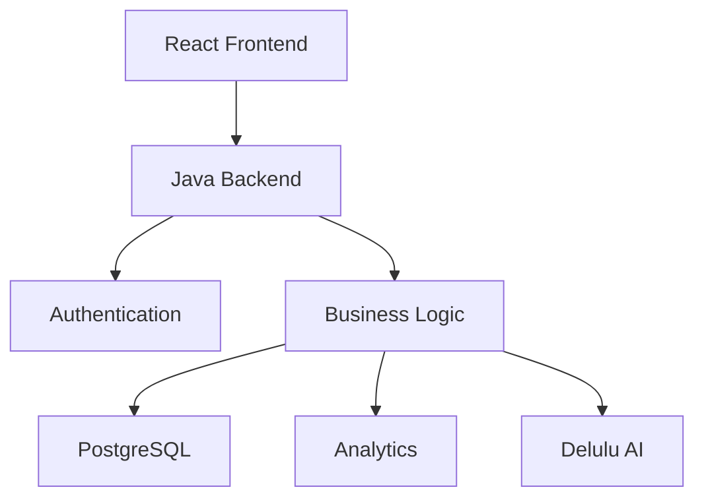

<div align="center">


# 🚀 ProjectFlow Pro

### AI-Powered Project & Task Management Ecosystem

<p align="center">

</p>

<p align="center">


</p>

<p align="center">


</p>

---

# ✨ Overview

ProjectFlow Pro is a modern **AI-powered Project & Task Management Platform**
designed to eliminate communication silos and improve collaboration through
real-time project visibility, intelligent task management and analytics.

Unlike traditional task managers, ProjectFlow Pro combines

- 🤖 AI Assistance
- 📊 Live Analytics
- 🔐 Secure RBAC
- 📋 Kanban Workflow
- 📝 Activity Audit Logs

into one unified productivity ecosystem.

---

# 🎥 Live Preview

<p align="center">


</p>

> Replace `assets/demo.gif` with your project demo GIF.

---

# 🖥️ Screenshots

| Dashboard | Kanban |
|------------|---------|
|  |  |

| Analytics | AI Assistant |
|------------|--------------|
|  |  |

---

# ⚡ Features

| Feature | Description |
|---------|-------------|
| 🔐 Role Based Access | Secure Admin / Manager / User roles |
| 📋 Kanban Board | Drag & Drop task workflow |
| 📊 Analytics Dashboard | Live project insights |
| 🤖 Delulu AI | Intelligent chatbot assistant |
| 📈 Charts | Chart.js visual analytics |
| 📝 Audit Logs | Complete activity history |
| 🔒 Authentication | Token-based login |
| 🗄 PostgreSQL | Structured relational storage |
| ⚡ High Performance | Thread-safe runtime collections |

---

# 🏗️ Architecture



---

# 🤖 Delulu AI Assistant

### Ask Questions Like

```text
How many projects are active?

Which tasks are overdue?

Show this week's progress.

Who completed the highest number of tasks?

Summarize Project Alpha.

List delayed milestones.
```

The AI instantly provides contextual project insights using natural language.

---

# 🛠️ Technology Stack

## Frontend

- React
- HTML5
- CSS3
- Tailwind CSS

## Backend

- Java HTTP Server
- Node.js

## Database

- PostgreSQL

## Visualization

- Chart.js

## AI

- Custom NLP Engine

## Design

- Glassmorphism UI
- Responsive Design

---
